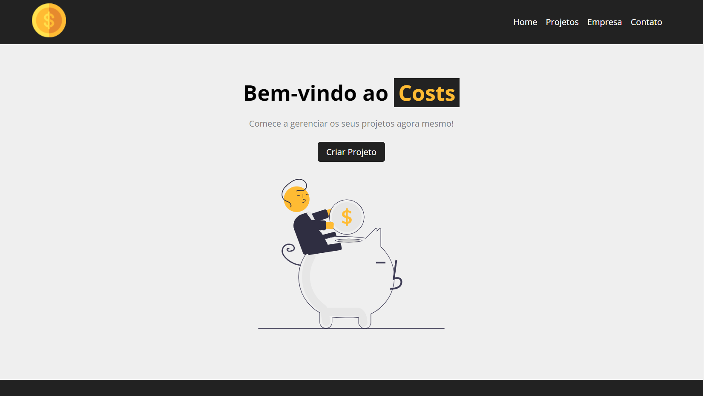
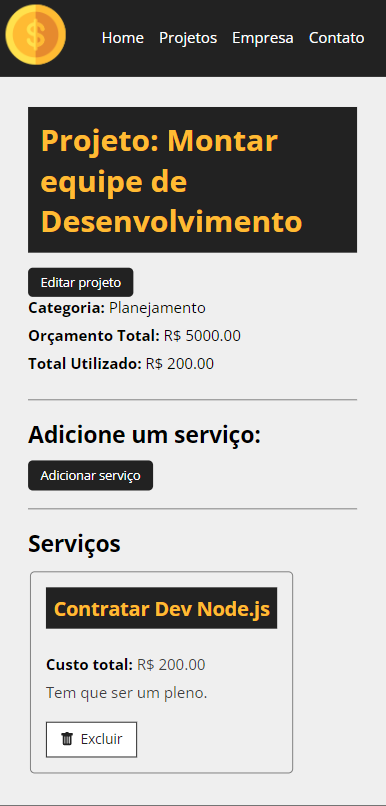

<h1 align="center">
  💻 Projeto
</h1>
<h4 align="center">
  Projeto criado para praticar e elevar conhecimentos e padrões de Desenvolvimento Front-end com SPA.
</h4>

## 🔎Preview

<h5>Desktop</h5>

<h5>Mobile</h5>

## 📬 Rotas

O site é composto por 6 rotas:

- **Home:** Apresentação da ideia do projeto, com link para a rota Novo Projeto;
- **Projetos:** A interface dessa rota, apresenta a listagem dos projetos cadastrados, com a possibilidade de exclusão, e acesso as rotas: "Novo Projeto" e "Editar";
- **Novo Projeto:** Nessa rota, temos acesso ao componente de formulario para criação de projetos no servidor json;
- **Editar:** Rota de projeto por cada id, com acesso ao formulario de edição do próprio projeto em questão, com formulario de criação de serviços dentro do projeto;
- **Empresa e Contato:** Paginas não feitas;

## 💼 Tecnologias utilizadas

Para o desenvolvimento deste site utilizei as seguintes tecnologias:

- HTML;
- CSS;
- Axios { GET }
- Fetch API { GET, POST, PATCH e DELETE }
- JavaScript;
- Json Server
- React.js(create-react-app);
  - useState;
  - useEffect;
  - useAxios ( Custom Hooks )
  - React-Router-Dom
  - react-icons;

---

## 📋 Descrição

    Projeto feito na participação da playlist: <a href="https://www.youtube.com/watch?v=OinwLJg8k88&list=PLnDvRpP8BneyVA0SZ2okm-QBojomniQVO&index=17">Curso de React</a>  
  Prof: Matheus Battisti  

 Páginas, Empresa e Contato, não foram finalizadas, a ideia do projeto era treinar o funcionamento do react com componentização, hooks, rotas e Data Fetching.

---

## ▶Execução

Comandos necessarios:

**npm start:** Sobe o front-end na porta 3000;

**npm run backend:** Sobe o back-end na porta 5000;

